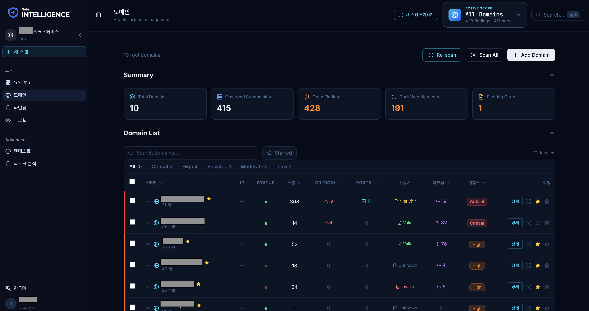
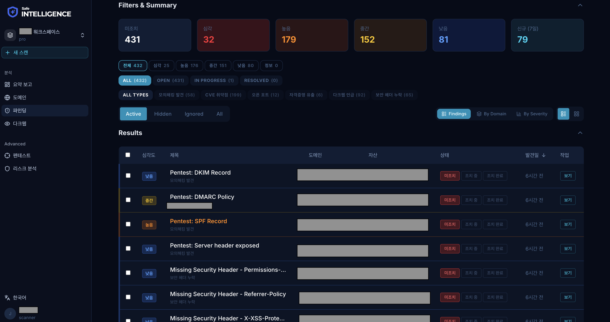
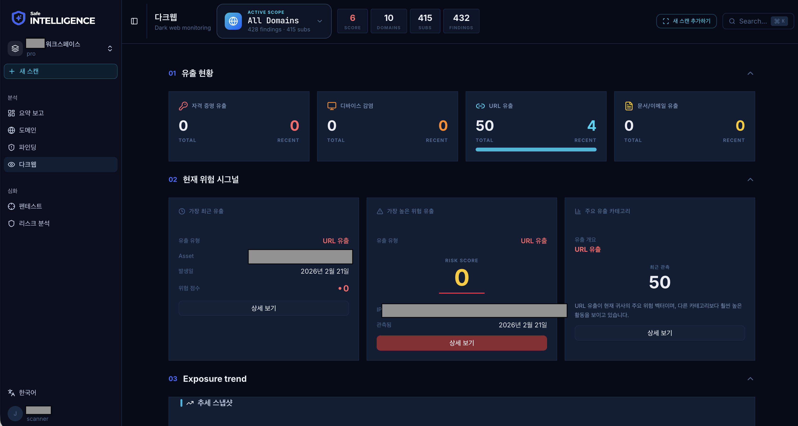

# SafeIntelligence 소개

**기업 보안 인텔리전스 플랫폼**

SafeIntelligence는 OSINT(Open Source Intelligence) 기반의 B2B 기업 보안 평가 플랫폼입니다. 도메인을 중심으로 조직의 보안 상태를 종합적으로 분석하고, 실시간 위협을 모니터링합니다.

## 주요 기능

### 요약 보고 (Overview)

한눈에 보는 조직 보안 현황. 즉시 조치가 필요한 발견사항, 자산 노출 현황, 다크웹 위협 인텔리전스를 3개 섹션으로 제공합니다.

<figure><figcaption></figcaption></figure>

### 도메인 관리 (Domains)

모니터링 대상 도메인과 서브도메인을 관리합니다. 각 도메인의 보안 등급, 발견사항 수, 최근 스캔 시간을 확인할 수 있습니다.

<figure><figcaption></figcaption></figure>

### 보안 발견사항 (Findings)

CVE 취약점, 인증서 만료, 다크웹 유출 등 모든 보안 이슈를 통합 관리합니다. 심각도별 필터링과 상태 관리를 지원합니다.

<figure><figcaption></figcaption></figure>

### 다크웹 모니터링 (Dark Web)

ZeroDarkWeb 연동을 통해 자격증명 유출, URL 유출, 감염 디바이스 등 다크웹 위협을 실시간으로 추적합니다.

<figure><figcaption></figcaption></figure>

### 스캔 관리 (Scanning)

도메인 및 서브도메인에 대한 보안 스캔을 실행하고 결과를 확인합니다. Nmap 포트 스캔, SSL 검증, CVE 탐지 등을 지원합니다.

### 검색 (Cmd+K)

전체 엔티티(도메인, IP, CVE, 이메일 등)를 통합 검색하고, 연관 자산을 탐색할 수 있습니다.

## 이 매뉴얼에 대해

이 매뉴얼은 SafeIntelligence 플랫폼의 사용자 가이드입니다. 각 페이지별 기능 설명, 사용법, 그리고 실제 화면 예시를 포함합니다.

시작하려면 [시작하기](getting-started/quickstart.md) 페이지를 확인하세요.
