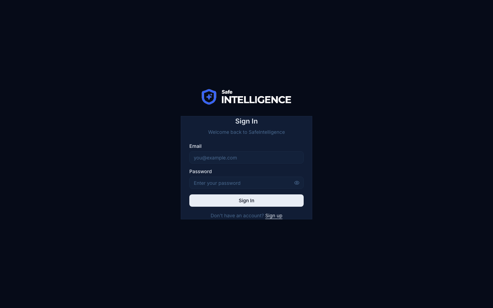

# ログインと認証

## SafeIntelligenceへのアクセス

組織のSafeIntelligence URLにアクセスし、ご自身のクレデンシャルでサインインしてください。

### サインイン

1. **メールアドレス**を入力します
2. **パスワード**を入力します
3. **サインイン**をクリックします

### ユーザーロール

| ロール | 説明 | アクセス権限 |
|--------|------|-------------|
| **スーパー管理者** | システム管理者 | すべての機能 + 管理パネルへのフルアクセス |
| **管理者** | 組織管理者 | 組織設定 + ユーザー管理 |
| **ユーザー** | 一般ユーザー | 分析機能（概要、ドメイン、脆弱性、ダークウェブ） |

### 言語の選択

SafeIntelligenceは3つの言語に対応しています：
- **English** --- 海外ユーザー向けのデフォルト言語
- **日本語** --- 日本語インターフェース
- **한국어** --- 韓国語インターフェース

言語はいつでもサイドバーフッターの言語選択アイコンから変更できます。

## セッション管理

- セッションはJWTトークンで管理されます
- セキュリティのため、トークンは自動的に有効期限が切れます
- セッションが期限切れになると、ログインページにリダイレクトされます
