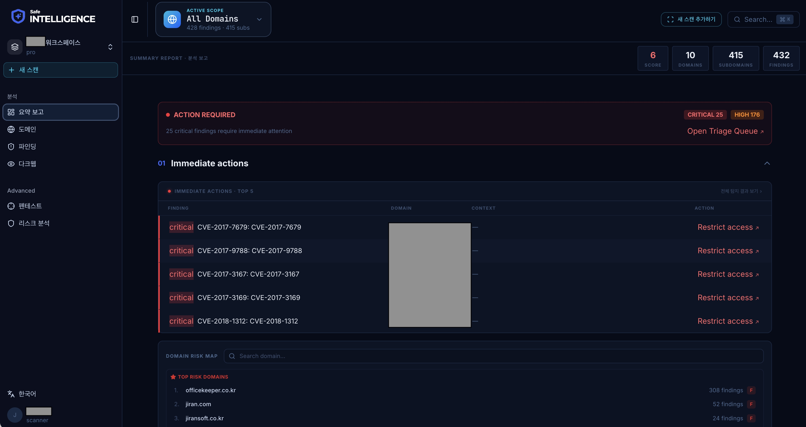

# 요약 보고 화면

**요약 보고**(Overview)는 로그인 후 가장 먼저 보이는 메인 화면입니다. 조직의 보안 현황을 3개 섹션으로 요약합니다.

<figure><figcaption></figcaption></figure>

## 화면 구성

### 상단: Active Scope

화면 상단에 현재 선택된 도메인 스코프가 표시됩니다. 클릭하여 특정 도메인을 선택하면 모든 데이터가 해당 도메인으로 필터링됩니다.

### 섹션 01: 즉시 조치 (Immediate Actions)

가장 긴급한 보안 이슈 TOP 5를 테이블 형태로 보여줍니다.

| 열       | 설명                             |
| ------- | ------------------------------ |
| 발견사항 제목 | 이슈 이름 (클릭하면 상세 페이지로 이동)        |
| 심각도     | Critical / High / Medium / Low |
| 도메인     | 영향받는 도메인                       |
| 리스크 점수  | 심각도 × 자산 중요도 기반 점수             |

**전체 파인딩 보기** 링크를 클릭하면 파인딩 목록 페이지로 이동합니다.

하단에는 **도메인 리스크 맵**과 **서브도메인 리스크 프리뷰**가 표시됩니다.

### 섹션 02: 자산 노출 현황 (Asset Exposure)

모니터링 중인 도메인들을 카드 그리드로 표시합니다. 각 카드에는:

* **보안 등급** (A\~F) — 색상 코딩된 원형 배지
* **도메인 이름**
* **서브도메인 수**
* **Critical / High 발견사항 수** — 심각도 배지
* **전체 발견사항 수**
* **마지막 스캔 시간**

카드를 클릭하면 해당 도메인의 상세 대시보드로 이동합니다.

### 섹션 03: 위협 인텔리전스 (Threat Intelligence)

다크웹 위협 정보와 AI 분석 결과를 보여줍니다.

**4개 KPI 지표:**

* **CREDENTIALS LEAKED**: 유출된 자격증명 수 (빨간색)
* **DARK WEB MENTIONS**: 다크웹 언급 수 (시안색)
* **COMPROMISED ACCOUNTS**: 위험에 노출된 계정 수 (노란색)
* **THREAT SOURCES DETECTED**: 탐지된 위협 소스 수 (초록색)

**다크웹 모니터링 보기 >** 링크를 클릭하면 다크웹 모니터링 페이지로 이동합니다.

하단에는 **AI 인사이트**(AI 분석 요약)와 **탐지된 소스**(위협 소스 목록) 사이드바가 표시됩니다.

## 데이터 갱신

요약 보고의 데이터는 실시간으로 갱신됩니다. 페이지를 새로고침하거나 도메인 스코프를 변경하면 최신 데이터를 확인할 수 있습니다.
