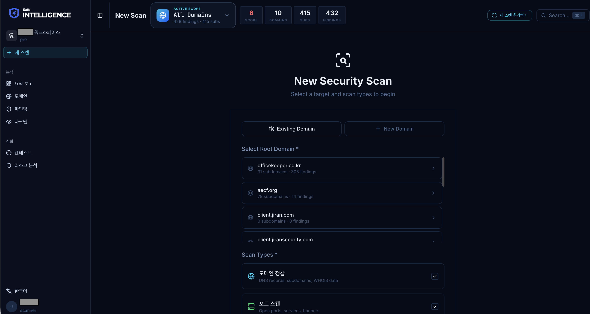

# 새 스캔 시작

## 개요

도메인에 대한 보안 스캔을 수동으로 시작할 수 있습니다. 스캔은 서브도메인 발견, 포트 스캔, CVE 탐지, 인증서 검증 등을 포함합니다.

<figure><figcaption></figcaption></figure>

## 스캔 시작 방법

### 방법 1: 헤더 스캔 버튼

페이지 상단 헤더 영역의 **스캔 버튼**을 클릭합니다. 현재 선택된 스코프(전체 또는 특정 도메인)에 대해 스캔이 시작됩니다.

### 방법 2: 도메인 상세 페이지

도메인 상세 페이지에서 개별 도메인에 대한 스캔을 시작할 수 있습니다.

## 스캔 유형

| 유형       | 설명                 | 소요 시간       |
| -------- | ------------------ | ----------- |
| 서브도메인 발견 | DNS 열거, 인증서 투명성 로그 | 1-5분        |
| 포트 스캔    | 주요 포트 오픈 여부 확인     | 2-10분       |
| CVE 탐지   | 알려진 취약점 매칭         | 1-3분        |
| 인증서 검증   | SSL/TLS 인증서 유효성    | 1분 미만       |
| 다크웹 모니터링 | 유출 정보 탐색           | 자동 (6시간 주기) |

## 스캔 제한

* 동시에 하나의 스캔만 실행 가능합니다
* 이전 스캔이 진행 중이면 새 스캔을 시작할 수 없습니다
* 스캔 중에는 진행률이 실시간으로 표시됩니다

## 스캔 취소

진행 중인 스캔은 **취소** 버튼으로 중단할 수 있습니다. 취소 시 이미 수집된 데이터는 유지되지만, 미완료 항목은 다음 스캔에서 다시 수행됩니다.
